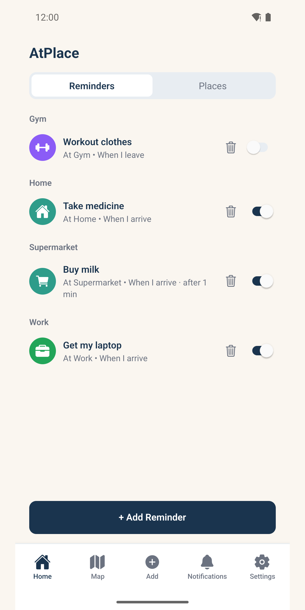
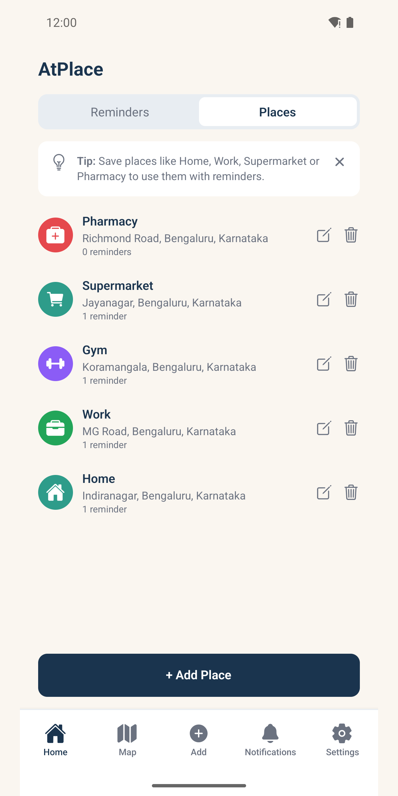
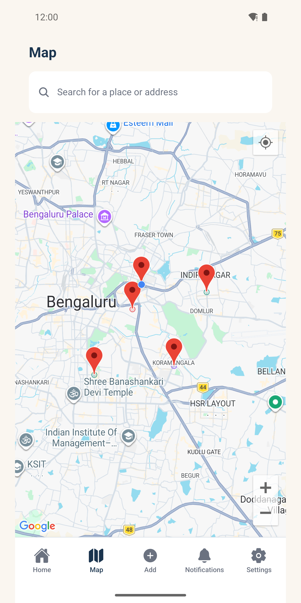
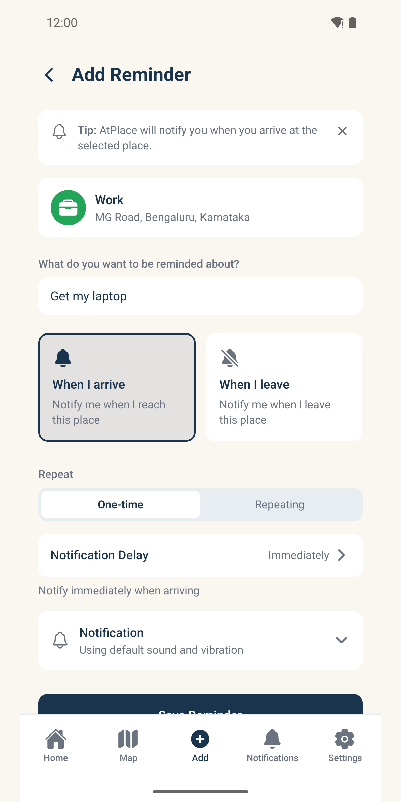
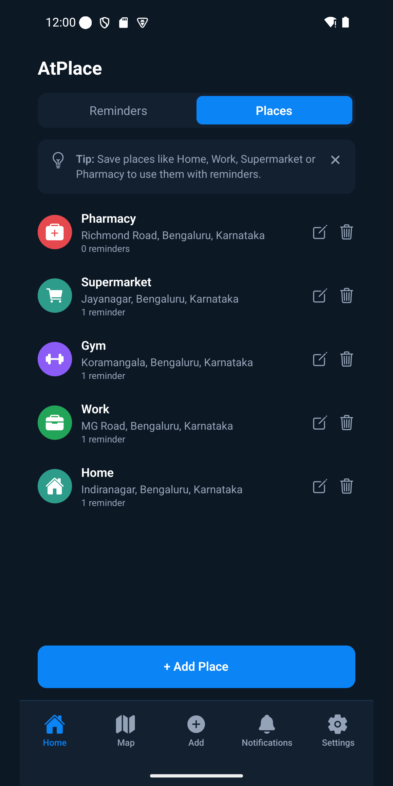

# AtPlace

### Be where it matters.

## Overview

AtPlace is a privacy-focused, location-based reminder app for Android. Instead of a to-do list you have to remember to check, AtPlace reminds you automatically the moment you arrive at—or leave—a place you've saved: take your laptop when you get to Work, grab milk when you reach the Supermarket, pick up your prescription at the Pharmacy. Everything runs entirely on your device, with no account, no cloud sync, and no internet connection required for normal use.

## Key Features

- **Location-triggered reminders** — Reminders fire automatically using geofencing when you arrive at, or leave, a saved place—no manual checking required.
- **Saved places** — Keep frequently visited locations like Home, Work, Gym, Supermarket, or Pharmacy, created by saving your current location, searching an address, or picking a spot on the map.
- **Configurable trigger radius** — Set how close you need to be before a place's geofence counts as "arrived."
- **Arrival and leave reminders, your way** — Choose whether a reminder fires once or repeats every time, and set a per-reminder notification delay (immediately, or 1–10 minutes) so briefly driving past a place doesn't trigger a false alert.
- **Map view** — See all your saved places together on one map, each with its own icon and color.
- **Backup & restore** — Export all your places and reminders to a file at any time, and restore them on the same or a new device.
- **Dark mode** — A polished dark theme that follows your system setting or your own choice.
- **Event log (Developer Mode)** — Optional diagnostics showing exactly when and how each reminder was delivered, for troubleshooting notification timing.
- **Privacy by design** — Location data is used only to power your own reminders and never leaves your device.

## Problems It Solves

To-do lists are easy to forget to check, and reminders tied to a time rather than a place often fire when you're nowhere near where you need to act. AtPlace closes that gap: the reminder shows up exactly when and where it's useful, without you having to remember to open the app.

## Who It's For

Anyone who regularly forgets small, place-specific tasks—picking something up on the way home, taking an item to the office, running an errand at a specific shop—and wants a nudge that appears automatically on arrival instead of relying on memory or a manually checked list.

## Platforms & Availability

- Platform: Android
- Status: In active development

## Screenshots

## Get Started

Learn More
